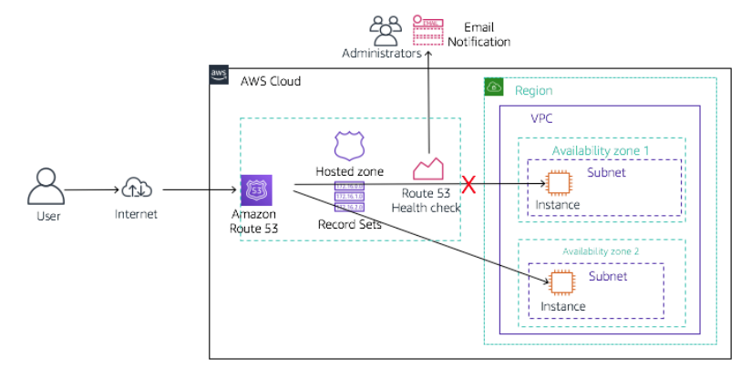

# Configure failover routing using Route 53

Click on following link to preview:

https://htmlpreview.github.io/?https://github.com/sameerkhule1/AWS_ProjectsAndLabs/blob/main/Configure%20failover%20routing%20using%20Route%2053/Workbench_files/README.html

