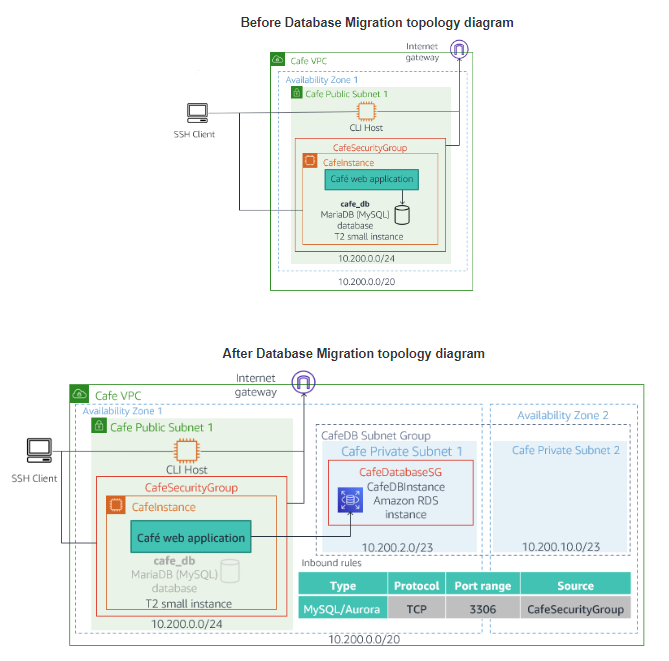

# Migrate data from local MariaDB to RDS and monitor using CloudWatch metrics

Click on following link to preview:

https://htmlpreview.github.io/?https://github.com/sameerkhule1/AWS_ProjectsAndLabs/blob/main/Migrate%20data%20from%20local%20MariaDB%20to%20RDS%20and%20monitor%20using%20CloudWatch%20metrics/Workbench_files/README.html

