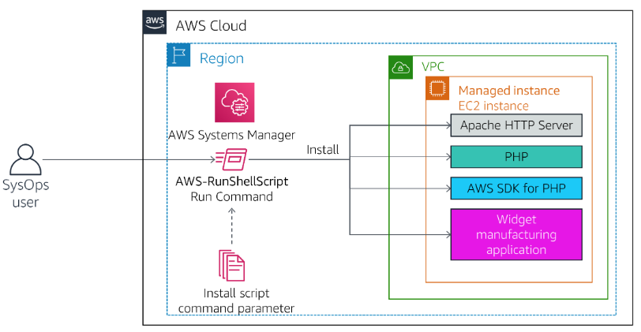

# Run tasks, update configs, and access CLI using AWS Systems Manager

Click on following link to preview:

https://htmlpreview.github.io/?https://github.com/sameerkhule1/AWS_ProjectsAndLabs/blob/main/Run%20tasks%2C%20update%20configs%2C%20and%20access%20CLI%20using%20AWS%20Systems%20Manager/Workbench_files/README.html

